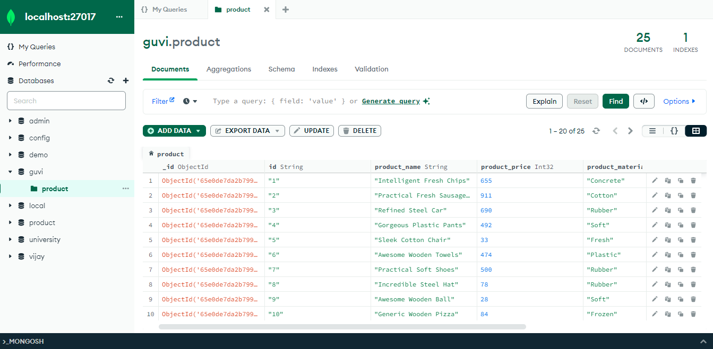

# MongoDB-Task-1

## Overview

A comprehensive set of MongoDB queries to manipulate and retrieve data from the products collection. This repository contains a set of MongoDB queries to perform various operations on the products collection based on the `product.json` data.



**JSON Data**

```bash
https://github.com/rvsp/database/blob/master/mongodb/product.json
```

## Key Concepts

- Database Creation
- CRUD Operations
- Data Filtering and Projection
- Sorting and Limiting Results
- Aggregation Basics

## Lessons Learned

- Creating databases and collections
- Performing CRUD operations
- Using comparison operators for data filtering
- Limiting and counting query results
- Applying projections to retrieve specific fields
- Deleting documents based on criteria
- Importing and exporting data
- Introduction to the aggregation framework

## Conclusion

This task provided a solid foundation in MongoDB, covering essential operations and techniques for efficient data management. It enhanced my understanding of database creation, CRUD operations, data filtering, and aggregation.
